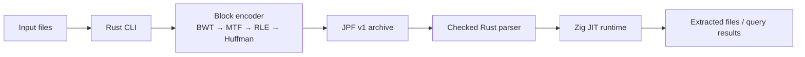

# JitPack

**A Research Archive Format with JIT-Specialized Decompression**

[](https://www.rust-lang.org/)
[](https://ziglang.org/)
[]()

> [!IMPORTANT]
> JitPack is an experimental archive toolchain. It executes generated native
> code while decoding archive blocks, and its format and implementation are
> still evolving. Do not use it for production data or as a security boundary.

---

JitPack is a Rust and Zig research project that explores archive decoding
specialized to each archive's canonical Huffman coding. The Rust workspace
handles compression, validated archive framing, encryption, and the command
line interface; the Zig runtime generates and runs host-native decode paths.

## Table of Contents

- [Research Objectives](#research-objectives)
- [Architecture](#architecture)
- [Documentation](#documentation)
- [Getting Started](#getting-started)
- [Command Interface](#command-interface)
- [Security Model](#security-model)
- [License](#license)

---

## Research Objectives

1. **Specialized decoding:** Explore replacing generic entropy-decoder loops
   with native branches generated for an archive's code tree.
2. **Portable archives:** Store archive data and coding metadata, not native
   machine code; generate host-specific code at extraction time.
3. **Defensive parsing:** Validate archive structure, resource limits, and file
   paths before decompression or filesystem writes.
4. **Authenticated encryption:** Support Argon2-derived keys and
   XChaCha20-Poly1305 encryption with archive headers and block parameters
   authenticated as associated data.

---

## Architecture



The workspace contains three crates:

- `jitpack-core` — compression primitives, archive framing, encryption, and
  shared validation.
- `jitpack-cli` — archive creation, extraction, querying, and SFX packaging.
- `jitpack-sfx` — self-extracting archive stub.

---

## Documentation

- [JPF v1 format specification](docs/format-v1.md)
- [Original design plan](docs/plan.md)

---

## Getting Started

### Prerequisites

- Rust 1.85.0+ (with Edition 2024 support)
- Zig 0.17.0-dev, available on `PATH`
- A supported Linux/Android `x86_64` or `aarch64` target

### Build

```bash
cargo build --release -p jitpack-cli
```

---

## Command Interface

| Subcommand | Description | Example Usage |
| :--- | :--- | :--- |
| `compress` | Compress files or directories into a `.jpf` archive | `jitpack compress <input...> <output.jpf>` |
| `decompress` | Extract a `.jpf` archive to a target directory | `jitpack decompress <archive.jpf> <output_dir>` |
| `list` / `ls` | List archive contents in dynamic tabular layout | `jitpack list <archive.jpf>` |
| `tree` | Display recursive directory tree using box-drawing characters | `jitpack tree <archive.jpf>` |
| `info` | Show archive layout metadata (version, ISA, encryption, etc.) | `jitpack info <archive.jpf>` |
| `cat` | Decompress a single file from the archive directly to stdout | `jitpack cat <archive.jpf> <file_path>` |
| `query` | Run in-memory JIT-compiled pattern search across the archive | `jitpack query <archive.jpf> <pattern>` |
| `sfx-pack` | Bundle a JPF payload with the SFX stub into an executable | `jitpack sfx-pack <input> <output_exe>` |

> [!TIP]
> **Options**:
> - Use `--password` during `compress` or `sfx-pack` to encrypt archive headers and blocks with Argon2 + XChaCha20-Poly1305.
>
> **Development**:
> - To run commands directly without compiling/installing the alias, use cargo:
>   `cargo run -p jitpack-cli -- <command> <args>`


---

## Security Model

JPF v1 uses bounded parsing, validates metadata and block framing, blocks path
traversal during extraction, and authenticates encrypted metadata and block
parameters. The JIT remains experimental: malformed or hostile archives should
be treated with caution until the runtime has broader fuzzing and platform
testing coverage.

---

## License

Licensed under the GNU Affero General Public License v3.0 (AGPL-3.0). See
[LICENSE](LICENSE).

---

<div align="center">

Built with 🦀 & ⚡ by [Seuriin](https://github.com/SSL-ACTX)

</div>
